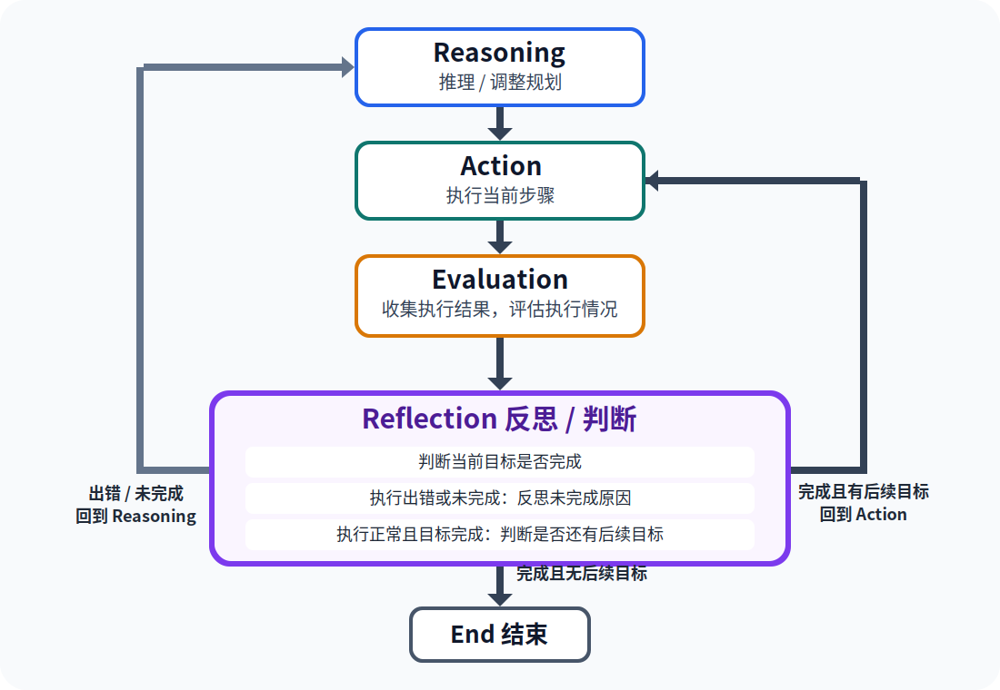

# 第2课：大模型智能体的框架

## 前一节课内容回顾

**3 分钟回顾：智能体不是更会聊天，而是围绕目标持续推进**

上一节课我们建立了三个核心认识：
- 大模型智能体是在大语言模型基础上构建的任务系统；
- 可以用 PaE 理解智能体：先规划（Plan），再执行并输出结果（Execute）；
- 提示词是组织大模型行为的重要接口，好的提示词要有任务、要求、格式、场景，并做到全面、一致、简洁、合理。

作业点评时，可表扬能把学习任务写清楚的提示词。例如有同学不只写“帮我复习数学”，还写出了考试时间、复习范围、每天可用时间、希望输出表格和自测题，并要求模型标出不确定内容。这类作业的优点在于：不是让模型猜，而是把任务边界交代清楚。

承接上一课的问题：提示词能把一个任务说清楚，但智能体完成复杂任务时，还需要一种稳定的流程。今天我们来学习一下如何可以更精细地控制大模型的思维方式。

## 内容引入

**3 分钟互动：同一个复习目标，可以怎样组织流程？**

教师展示请求：

```text
我下周三考物理，电路和电磁感应薄弱，每天有 45 分钟。请帮我复习。
```

请学生快速回答：如果你是学习支持智能体，第一步应该做什么？

可能答案包括：先问考试范围、先列知识点、先查课程资料、先做诊断题、先安排计划。教师把这些答案写在黑板上，再追问：如果每一步都可能影响下一步，我们怎样避免智能体想到哪做到哪？

引出本课核心：智能体框架就是把“想什么、做什么、看见什么、下一步怎么变”组织成可追踪流程的方法。

## 知识点讲授

### 1. 回顾 PaE：先规划，再执行

PaE 是本课程理解智能体的基础流程，重点是先把复杂任务转化成清晰计划，再按计划完成具体动作并输出结果：

```text
Plan 计划
  ↓
Execute 执行并输出结果
```

放在考前复习场景中：

- Plan：
  - 理解用户目标、考试时间、科目范围、薄弱知识点、可用复习时间、已有错题和课程资料；
  - 把任务拆成清晰步骤，确定先做什么、后做什么、可能使用哪些工具，以及最终要输出什么结果；
- Execute：
  - 根据计划生成知识卡片、调用知识库、安排日程、生成自测题、批改答案、整理错因；
  - 输出执行结果，并标注不确定内容和需要老师确认的部分。

PaE 的价值在于让学生看到：智能体不是直接回答一句话，而是先把目标、条件和步骤组织成方案，再按照方案推进任务。

**提问：** 但是，如果执行阶段不及预期，甚至出现错误和意外的时候应该怎么办？  
**回答：** 这就需要让智能体能够自行评估执行的效果，动态地调整执行计划了。（引出 ReAct 框架）

### 2. ReAct：推理、行动、评估、反思

ReAct 可以理解为一种更细的智能体工作方式。它把任务推进拆成 Reasoning、Action、Evaluation 和 Reflection 四个可见环节：



<!-- 这里的 Reasoning 不一定要展示模型所有内部思考，更适合在课堂中理解为“下一步判断依据”。也就是让智能体说明：为什么现在要做这一步。 -->

Reasoning 在一开始的时候根据任务生成一份初始的执行规划，并且在任务执行的进展过程中结合执行结果（经常是错误的结果）判断是否要以及如何调整规划。

Evaluation 负责收集 Action 的执行结果，并评估执行情况。Reflection 负责根据 Evaluation 的结果做分支判断：先判断当前目标是否完成；如果执行出错或当前目标没有完成，就反思未完成原因，再回到 Reasoning 调整规划；如果执行正常并且当前目标已经完成，就判断是否还有后续目标，有后续目标则回到 Action 继续执行下一步，没有后续目标则结束。

用复习电磁感应举例：

```text
目标：帮学生复习电磁感应
Reasoning：需要先确认考试范围和学生薄弱点
Action：调用课程知识库检索“电磁感应核心概念”
Evaluation：已获得核心概念，但还不能判断学生是否真正掌握方向判断
Reflection：当前目标“定位薄弱点”尚未完成，原因是只检索知识点还不够，需要加入诊断题
Reasoning：下一步应安排概念辨析和专项题
Action：生成 3 道方向判断自测题
Evaluation：收集自测结果，学生第 2 题出错
Reflection：当前目标没有完全完成，可能是右手定则和楞次定律的适用场景混淆
Reasoning：需要补充对比讲解，再安排针对性练习
Action：生成对比讲解和 2 道针对性练习
Evaluation：学生能正确完成针对性练习
Reflection：当前目标已完成，如果还有后续复习目标，就回到 Action 继续下一步；如果没有后续目标，就结束
```

**注意：** 上述例子中结合了用户（学生）的反馈输入，大多数智能体在执行的过程中收集的反馈是来自智能体自己内部的执行结果。

ReAct 的重点是：每次 Action 后先进入 Evaluation 收集和评估执行情况，再进入 Reflection 判断目标状态和后续目标，并决定是继续执行、结束，还是回到 Reasoning 调整规划。

### 3. 多智能体架构

前面讲到，复杂任务往往要先拆成多个步骤。但拆完以后还会遇到一个新问题：每一步需要的能力可能不一样。

例如，学习支持智能体要帮学生复习物理。规划复习路线需要理解学生目标和时间安排；出题需要理解知识点、题型和难度；如果题目里还需要电路图、受力图或实验装置图，就可能需要调用专门的图片生成智能体。图片生成智能体擅长根据描述生成图像，但它的文本理解、题目设计和答案解析能力可能不如专门的出题智能体。这个时候，如果只让一个智能体包办所有步骤，质量可能不稳定。

因此，复杂任务可以拆给多个角色型智能体协作。它们不是多个真正的人，而是系统中多个分工明确的模型角色或模块。

在考前复习智能体中，可以设计：

- 规划智能体：制定复习顺序和时间安排；
- 知识讲解智能体：解释概念和易错点；
- 出题智能体：生成练习题，控制题型、难度和答案解析；
- 图片生成智能体：根据题目需要生成电路图、示意图或实验装置图；
- 批改智能体：检查答案和错因；
- 安全审核智能体：检查是否涉及作弊、隐私或过度承诺。

多智能体的价值是分工更清楚，复杂任务质量可能更高。例如出题者专注题目质量，审核者专注风险和边界。

但它也有风险：协调成本变高，不同智能体可能重复判断、互相误导，甚至让责任边界更模糊。因此多智能体不是越多越好，而是当任务真的需要分工时才使用。

### 4. 任务拆解和规划

智能体要完成“帮我复习”这样的任务，必须先把大目标拆成小步骤。

一个可执行的拆解示例：

```text
1. 提取学生目标和限制条件；
2. 确认考试范围和薄弱知识点；
3. 检索课程资料和错题记录；
4. 安排 5 天复习顺序；
5. 每天生成复习卡片和自测题；
6. 根据自测结果调整后续计划；
7. 标注不确定内容和需要老师确认的部分。
```

好的任务拆解应该满足三个条件：

- 步骤之间有合理顺序；
- 每一步能明确判断是否完成；
- 遇到缺失信息时知道追问或暂停，而不是编造。

### 5. CoT：链式思维

CoT 是 Chain of Thought，链式思维。课堂上可以把它理解为引导模型按连续步骤解决问题。

它适合顺序很清楚的任务，例如：

```text
先梳理概念
再看典型例题
再做自测题
再根据错题复盘
最后调整计划
```

在物理题中，CoT 也适合一步步分析条件、列公式、计算、检查单位。但教师要提醒学生：分步输出看起来更有条理，不代表一定正确，仍然要检查公式、条件和结论。

### 6. ToT：树状思维

ToT 是 Tree of Thought，树状思维。它适合同时生成多条路线，再比较哪条更好。

例如为 5 天物理复习设计方案，可以让模型比较：

- 按知识点复习：先电路，再电磁感应；
- 按错题复习：先处理高频错题；
- 按考试题型复习：选择题、计算题、实验题分别训练。

ToT 的价值在于不急着采用第一种方案，而是让模型比较多种可能。缺点是耗时更长，也可能比较标准不清，所以提示词中要写明评价标准，例如“时间是否可执行、是否覆盖薄弱点、是否便于自测”。

### 7. GoT：图状思维

GoT 是 Graph of Thought，图状思维。这里的“图”不只是让学生画一张知识网络，而是指系统内部可以形成一种拓扑结构：多个智能体像网络节点一样各自负责一个知识点，相关知识点之间的智能体互相关联，需要时一起参与推理和辅导。

例如在电磁感应中，可以把“楞次定律”设计成一个知识点智能体。它不是孤立工作的，因为学生理解楞次定律时，经常还需要调用其他相关知识点智能体：

```text
楞次定律智能体
  ↔ 磁通量智能体：理解磁场强弱、线圈面积、夹角变化怎样造成磁通量变化
  ↔ 法拉第电磁感应定律智能体：理解感应电动势与磁通量变化率的关系
  ↔ 磁场方向智能体：判断原磁场、感应磁场和电流产生的磁场方向
  ↔ 安培定则智能体：根据感应磁场方向反推感应电流方向
  ↔ 右手定则智能体：处理导体切割磁感线时的方向判断
  ↔ 闭合电路与欧姆定律智能体：判断是否产生感应电流，以及电流大小
  ↔ 能量守恒智能体：理解“阻碍变化”不是“阻止变化”，而是符合能量转化
```

如果系统发现学生的楞次定律薄弱，楞次定律智能体就可以联合磁通量、磁场方向、安培定则、能量守恒等相关智能体一起工作：先补前置概念，再做方向判断训练，最后用综合题检查学生是否真正建立起相关知识体系。

GoT 的价值在于让多智能体系统不只是简单排队执行，而是根据知识点之间的关联形成一张网络。它不一定用于每个任务，但适合知识关系复杂、依赖较多、需要多个知识点智能体协同辅导的学习场景。

### 8. 五种提示词技巧

角色扮演：让模型明确自己以什么身份工作，以及应该关注什么边界。

```text
你是一名初中物理老师，请用适合初二学生理解的方式，帮我讲清楚电磁感应中的楞次定律。不要直接给大学物理公式，重点解释概念、易错点和例题思路。
```

样例提示：给模型一个输入和输出样例，让它模仿样例的结构、语气和细节程度。

```text
请参考下面的样例，为“楞次定律”生成同样格式的知识卡片。

样例：
知识点：欧姆定律
一句话解释：电流大小等于电压除以电阻。
易错点：不要把电压、电流、电阻的单位混淆。
自测题：已知 U=6V，R=3Ω，求 I。
```

分步提示：让模型按步骤推进，先完成前一步，再进入后一步。

```text
请分三步完成：第一步判断学生在楞次定律中可能薄弱的前置概念；第二步设计 3 道诊断题；第三步根据诊断结果给出补救建议。
```

结构化输出：规定输出字段、顺序和格式，方便阅读、检查或交给后续智能体继续处理。

```text
请按表格输出，列名为：日期、复习目标、关键知识点、练习任务、检查标准、需要老师确认的内容。
```

选择对话上下文：告诉模型应该使用哪些信息、忽略哪些信息，避免把无关上下文带入当前任务。

```text
请只依据下面这段学生信息制定复习计划，不要使用前面对化学复习的讨论内容。

学生信息：下周三物理考试，薄弱点是电磁感应和电路分析，每天有 45 分钟复习时间，希望输出 5 天安排和自测题。
```

教师要提醒学生：提示词通常不是一上来就最优的。一次输出不理想时，不一定是模型完全不能做，而可能是角色不清楚、样例不够、步骤太粗、格式不明确，或者上下文选择有问题。实际使用中，提示词往往需要经过多轮迭代修改：观察输出、找到问题、补充约束、再测试。

在工程实践中，也经常会“用提示词生成提示词”。也就是先让模型根据任务目标、受众、输出格式和限制条件，生成几版候选提示词，再由人或另一个审核智能体选择、修改和测试。例如：

```text
请根据以下任务，帮我设计 3 版提示词，并说明每版适合什么场景、可能有什么风险。

任务：为初二学生生成 5 天电磁感应复习计划，要求包含知识讲解、自测题、错因分析和人工确认事项。
```

### 9. 什么时候用哪种框架

| 场景 | 更适合的方式 |
| ---- | ------------ |
| 只需要解释一个概念 | 普通结构化提示词 |
| 要把目标拆成流程 | PaE |
| 要边查边做、根据结果调整 | ReAct |
| 任务复杂，需要多个角色检查 | 多智能体 |
| 步骤顺序清楚 | CoT |
| 需要比较多条方案 | ToT |
| 知识点相互依赖复杂，需要多个知识点智能体协作 | GoT |

不同的智能体框架可以互相嵌套，结合变成更复杂的架构。

### 10. 知识点讲授时间安排

| 时间 | 内容 |
| ---- | ---- |
| 2 min | 回顾 PaE、提示词和智能体定义 |
| 2 min | 用复习任务说明框架的作用 |
| 5 min | 讲解 PaE 与 ReAct |
| 3 min | 讲解多智能体分工和风险 |
| 4 min | 讲 CoT、ToT、GoT |
| 4 min | 讲 5 种提示词技巧和框架选择 |

## 互动强化

**20 分钟活动：提示词迭代游戏**

3 位同学和老师一起配合，通过多轮迭代修正提示词，使模型能够较好地完成一个特定任务。这个活动的重点不是一次写出完美提示词，而是让学生体验“输出结果评估 -> 找问题 -> 改方案 -> 改提示词 -> 再测试”的调试过程。而且整个流程也是模拟的 ReAct 的智能体架构，每个人（学生和豆包）分别是架构中的一环。

### 任务

学校文学社需要一篇关于“人工智能与人类未来”的微型科幻小说，300 字左右，用于公众号配文。

文学社的要求是：

- 不要写成枯燥的议论文；
- 要有人情味；
- 略带感伤；
- 符合社会主义价值观；
- 有一个意想不到的反转结尾。

### 初始提示词

```text
帮我写一篇关于人工智能与人类未来的科幻小说。
```

### 角色分工

- 学生 A：根据当前提示词下豆包的输出结果，判断是否符合任务要求。如果符合，则迭代结束；如果不符合，只给出一条最重要的不符合原因。
- 学生 B：根据学生 A 提出的原因，设计一条改进方案。
- 学生 C：根据学生 B 的改进方案修改提示词，并在新的对话中重新让豆包根据修改后的提示词回答。
- 教师：负责控制节奏，在必要时帮助学生 A 提出更明确的要求，并把交互轮次控制在 3-4 轮。

### 活动流程

1. 教师展示任务要求和初始提示词。
2. 学生 C 在豆包中运行初始提示词，展示模型第一次输出。
3. 按照 A -> B -> C 的顺序循环：
   - A 判断输出是否符合要求；如果不符合，只说一条问题；
   - B 针对这一条问题提出修改方向；
   - C 把修改方向写进新提示词，并在新对话中重新运行；
   - 全班观察新输出是否比上一轮更接近任务要求。
4. 当学生 A 认为输出已经符合要求时，迭代结束。
5. 教师总结：这次活动中，哪些提示词修改最有效？是补充角色、增加样例、明确字数和风格，还是规定输出结构和价值边界？

### 预期结果

学生在 3-4 轮修改后，能够得到一篇比较符合任务要求的微型科幻小说：内容不再像议论文，有具体人物和情感，有略带感伤的氛围，价值导向正面，并且结尾有一定反转。教师要提醒学生：这正是实际使用和工程开发中常见的提示词迭代过程。

## 课后提升

**20 分钟小作业：为一个学习目标设计三种智能体流程**

选择一个自己的学习目标，完成：

1. 写出 PaE 流程；
2. 写出至少两轮 ReAct 循环；
3. 设计一个多智能体分工图；
4. 说明这个任务更适合 CoT、ToT 还是 GoT；
5. 写一条包含任务拆解、输出格式和自我检查要求的提示词。

拓展任务：请自行查阅资料，了解 Skills 是什么概念，以及它是如何管理提示词的。用 200-300 字说明：Skills 和普通提示词有什么不同？它怎样把提示词、任务说明、示例或工具使用要求组织起来，方便智能体在特定任务中复用？
